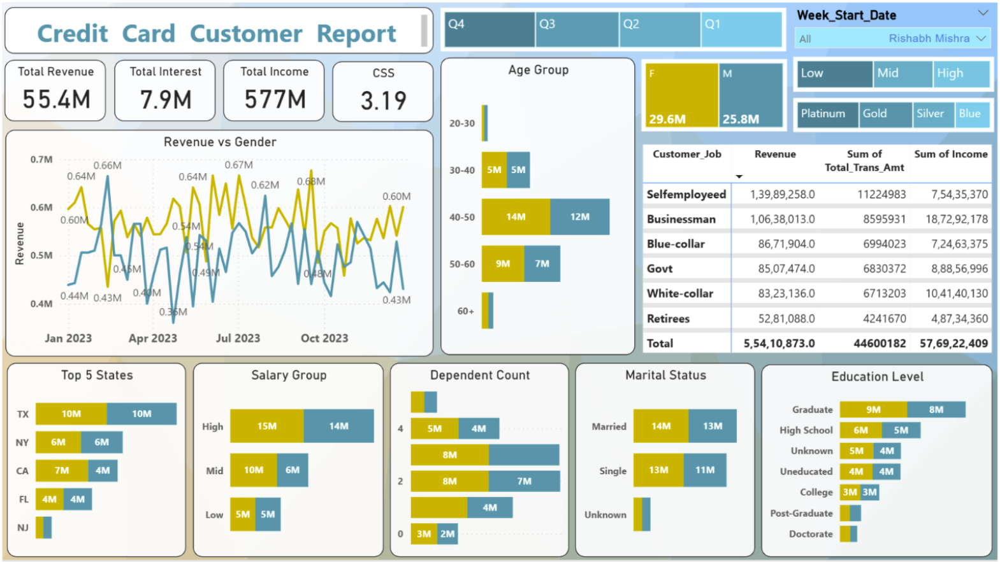
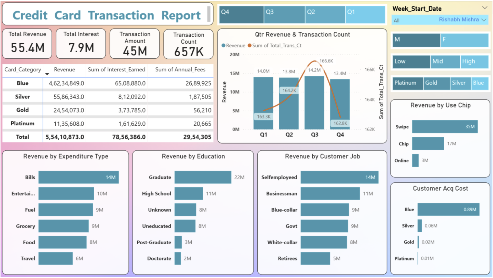

# Financial_Dashboard

## Overview

This project presents a Credit Card Financial Analysis Dashboard developed using Microsoft Power BI.
The dashboard provides a comprehensive view of customer behavior and transaction performance, enabling financial institutions to analyze revenue, interest earnings, customer demographics, spending patterns, and card usage trends.

The project consists of two interactive report pages: Customer Report, Transaction Report

The data is sourced from CSV files, transformed using Power Query, and analyzed using DAX measures.

## Objectives

* Analyze overall credit card revenue and interest earnings
* Understand customer demographics and segmentation
* Identify high-revenue customer groups
* Track transaction volume and spending behavior
* Evaluate card performance and acquisition costs
* Support strategic financial and marketing decisions

## Tools & Technologies

* Microsoft Power BI Desktop
* Power Query
* DAX (Data Analysis Expressions)
* CSV Files as data source

## Data Preparation & Modeling

* Imported raw CSV datasets into Power BI
* Cleaned and transformed data using Power Query
* Created calculated measures using DAX, including:
  * Total Revenue
  * Total Interest Earned
  * Transaction Amount and Count
  * Customer Satisfaction Score (CSS)
* Built relationships for accurate cross-filtering between customer and transaction data

## Dashboard Pages & Features

### 1. Customer Report

* Summary Metrics
* Revenue vs Gender
* Age Group Analysis
* Customer Job Segmentation
* Top States Analysis
* Salary Group Analysis
* Dependents Analysis
* Marital Status Analysis
* Education Level Analysis
* Filters & Controls

### 2. Transaction Report

* Top-Level Financial Metrics
* Card Category Performance
* Quarterly Performance
* Revenue by Expenditure Type
* Revenue by Education Level
* Revenue by Job Type
* Revenue by Transaction Mode
* Customer Acquisition Cost
* Filters & Controls

## Key Insights

* **Blue cards** generate the highest revenue and interest
* Spending is highest in **Bills and Entertainment**
* Swipe transactions dominate overall revenue
* Certain professions and income groups contribute significantly to revenue
* Acquisition costs vary widely across card categories

## Dashboard Preview

### Customer Report

### Transaction Report

